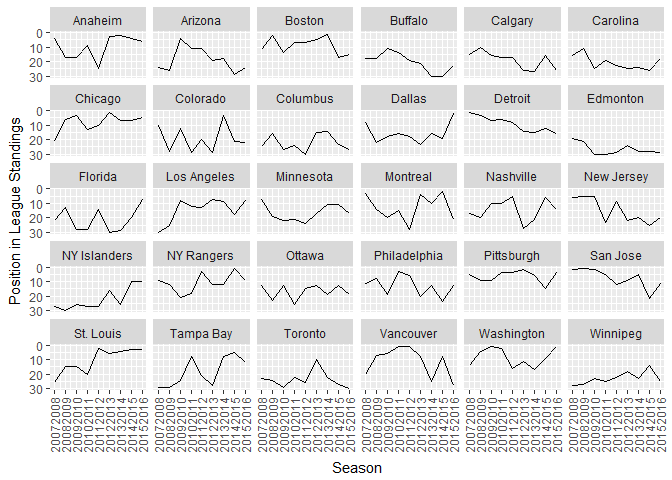
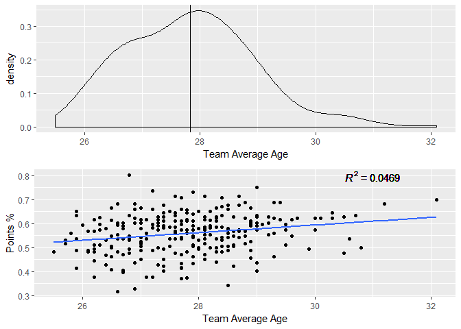
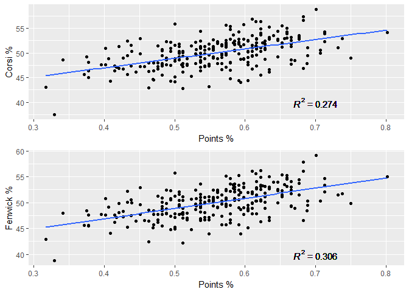
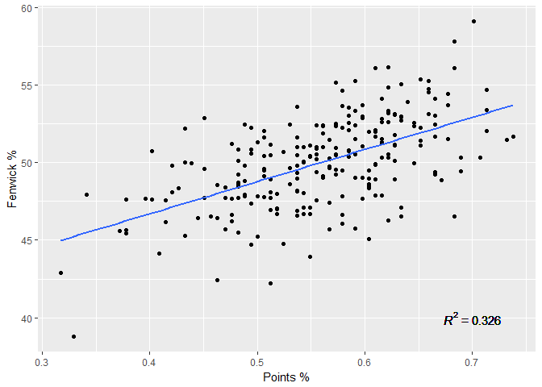

Introduction
------------

Having read several articles on advanced stats in hockey, I decided I wanted to look into and investigate some of the data for myself. I will be looking at the relationship between some of the statistics, such as between Corsi and winning, and doing basic exploratory analysis of the data, to reproduce the results on my own.

Data
----

I downloaded 5v5 Team Stats data for all of the completed seasons from 2007-2008 to 2015-2016 from www.corsica.hockey as well as the League Summary Team Statistics for the same seasons from hockey-reference.com Using R, I merged these two datasets together based on the season and team names, giving me a dataframe with a total of 270 (30 teams x 9s seasons) rows and 75 columns of various statistics.

``` r
names(nhl_data)
```

    ##  [1] "Season"      "long"        "Team"        "Season.Type" "GP.x"       
    ##  [6] "TOI"         "CF"          "CA"          "CF60"        "CA60"       
    ## [11] "CF."         "CSh."        "CSv."        "FF"          "FA"         
    ## [16] "FF60"        "FA60"        "FF."         "FSh."        "FSv."       
    ## [21] "SF"          "SA.x"        "SF60"        "SA60"        "SF."        
    ## [26] "Sh."         "Sv."         "xGF"         "xGA"         "xGF60"      
    ## [31] "xGA60"       "xGF."        "SCF"         "SCA"         "SCF60"      
    ## [36] "SCA60"       "SCF."        "xFSh."       "xFSv."       "Adj.FSv."   
    ## [41] "PDO.x"       "xPDO"        "GF.x"        "GA.x"        "GF60"       
    ## [46] "GA60"        "GF."         "FO."         "PENDIFF"     "Rank"       
    ## [51] "AvAge"       "GP.y"        "W"           "L"           "OL"         
    ## [56] "PTS"         "PTS."        "GF.y"        "GA.y"        "SRS"        
    ## [61] "SOS"         "TG.G"        "PP"          "PPO"         "PP."        
    ## [66] "PPA"         "PPOA"        "PK."         "SH"          "SHA"        
    ## [71] "S"           "S."          "SA.y"        "SV."         "PDO.y"

Team Performance by Season
--------------------------

The first thing I decided to look at is each team's performance in each season by the position they finished in, 1-30, variable Rank in the dataset. *Please note that in this data, "Winnipeg" refers to the current Winnipeg Jets (seasons 2011-2012 to 2015-2016) and to the Atlanta Thrashers prior to that (seasons 2007-2008 to 2010-2011).*



As can be seen above, the best teams over this period look to have been Boston, Chicago, Los Angeles and Pittsburgh - which makes sense as they are the teams to win the last 8 Stanley Cup Championships. The Detroit Red Wings won in 2007-2008, the first season in this dataset, and have been in decline since. The worst teams over this period have been Carolina, Edmonton, Toronto and Winnipeg.

Team Average Age
----------------

The next thing I looked at was the distribution of the average age of each team in each season. In addition, I wanted to see if there was a relationship between the average age of a team and their Points % (points divided by maximum possible points). I have decided to use Points % instead of the number of points earned in a season to account for the shortened season in 2012-2013 where only 48 games were played instead of 82.



The average age is represented by the vertical line in the first graph, and is just below 28 years. The distribution is skewed to the right.

With an *R*<sup>2</sup> value less than 0.05, there is not a strong relationship between a team's average age and the percentage of points earned.

Corsi and Fenwick Percentage
----------------------------

Corsi and Fenwick are some of the most talked about 'advanced stats' in hockey, and are a proxy for puck possession. They are based off of shot attempts, and the formula for each are as follows:

Corsi = Shot Attempts = Shots + Missed Shots + Blocked Shots

Fenwick = Shots + Missed Shots

The idea is that outshooting the other team, and therefore having a higher Corsi or Fenwick percentage, should lead to scoring more goals than the opposition and to more wins.



As shown above, the plots for both Corsi and Fenwick look quite similar. Given the *R*<sup>2</sup> values, we can conclude that Fenwick % is slightly more correlated with Points % and winning. Although, a postive correlation exists it is not very strong.

What if we only use the seasons with a complete 82 game schedule, dismissing the 48 game season as perhaps too small of a sample for Fenwick % to be correlated with Points %.



We see a slight increase in the *R*<sup>2</sup> value, but it is still not a strong positive correlation. Therefore, while Corsi and Fenwick % can be considered a factor in the percentage of points a team wins, it is not the only factor that should be looked at when evaluating a team's performance.

*The complete R code and data I used can be found in my github repository: .*
